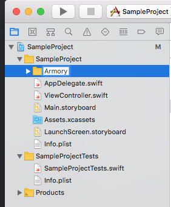
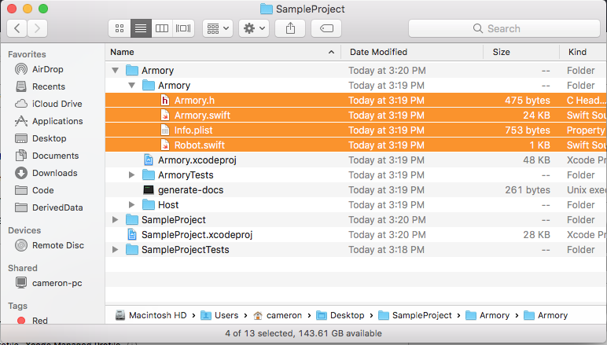
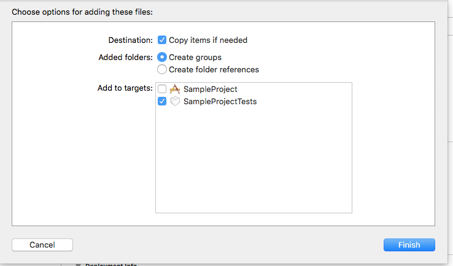
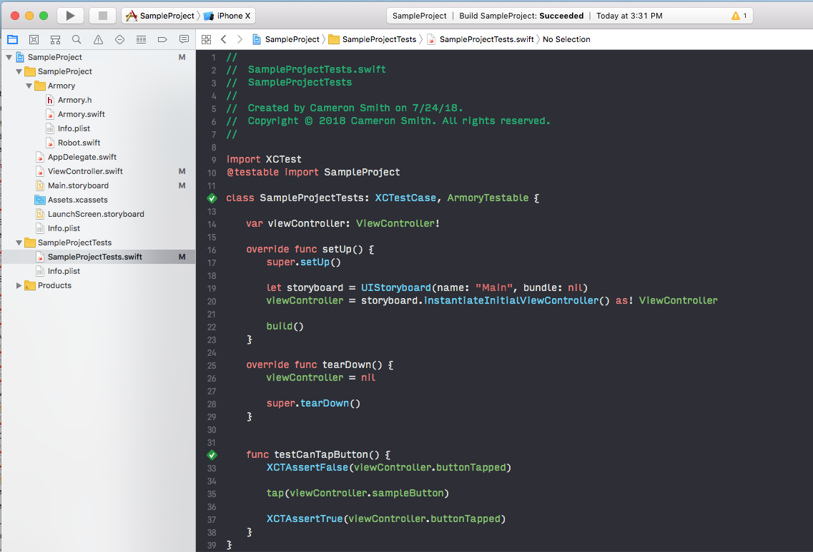

# Armory

Armory is a testing framework for iOS written in Swift

## Installation

1) Add Armory as a git submodule for your project:

`git submodule add git@github.com:stablekernel/Armory.git`

2) Create a group for Armory

3) Drag the source files from Armory/Armory into the group

4) Add the files to your test target

5) Make sure your test class conforms to `ArmoryTestable`

